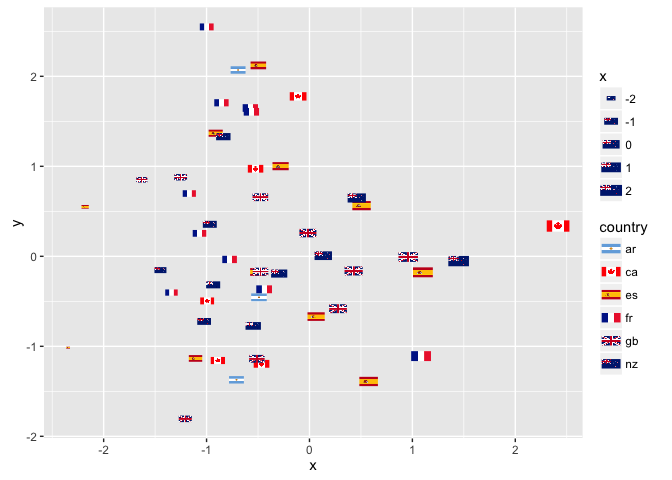

ggflags
-------

flag geom for ggplot2

    library(ggflags)

    ## Loading required package: ggplot2

    data(lflags)
    set.seed(1234)
    d <- data.frame(x=rnorm(10), y=rnorm(10), 
                    country=sample(c("ar","fr"), 10, TRUE), 
                    stringsAsFactors = FALSE)
    ggplot(d, aes(x=x, y=y, country=country, size=x)) + 
      geom_flag() + 
      scale_country()

<!-- -->
